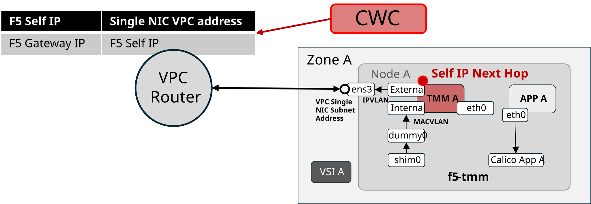

# BIG-IP Next for Kubernetes on IBM ROKs Single NIC Deployment build 2.3.0-ehf-2-3.2598.3-0.0.17

## This Schematics ready terraform workspace corresponds to the F5 engineering March 30th, 2026 demonstration of BIG-IP Next for Kubernetes installed in IBM Cloud ROKs clusters.

### Testable Deployment Features:

The engineering demonstration code provides the ability to test the following BIG-IP Next for Kubernetes on IBM ROKs cluster features.

#### VPC static route orchestration from F5 CWC in-cluster controller enabling f5-tmm pod Self-IP next hop addresses for ingress Gateway listener IP addresses and f5-tmm pod Self-IP for egress SNAT addresses



#### BIG-IP Virtual Edition DNS Services integration for GSLB access to BIG-IP Next for Kubernetes ingress Gateway listeners IP Addresses

[insert picture here]

#### IBM cloud TGW attached ingress and egress flows from an external VPC connected test client jumphost or other externally TGW connected clients

[insert picture here]

#### In VPC ingress from other VSIs in the same VPC as the IBM ROKs cluster

[insert picture here]

## Overview

This project provides Terraform orchestrated configuration of IBM ROKs cluster creation and F5 BIG-IP Next for Kubernetes deployment as independent, reusable modules.

## Directory Structure

```
terraform-cloud-ibm/
├── main.tf                    # Root module configuration
├── variables.tf               # Root module variables
├── outputs.tf                 # Root module outputs
├── providers.tf               # Provider configuration
├── terraform.tfvars           # Variable values
├── modules/
│   ├── cluster/              # IBM Cloud OpenShift cluster module
│   │   ├── main.tf           # Cluster infrastructure resources
│   │   ├── variables.tf      # Cluster module variables
│   │   ├── outputs.tf        # Cluster module outputs
│   │   └── providers.tf      # Cluster provider configuration
│   ├── cert-manager/         # Cert-manager module
│   │   ├── main.tf           # Cert-manager resources
│   │   ├── variables.tf      # Cert-manager variables
│   │   └── outputs.tf        # Cert-manager outputs
│   ├── flo/                  # FLO (F5 Lifecycle Operator) module
│   │   ├── main.tf           # FLO deployment resources (includes CIS helm chart)
│   │   ├── variables.tf      # FLO module variables
│   │   ├── outputs.tf        # FLO module outputs
│   │   └── versions.tf       # FLO provider requirements
│   ├── cneinstance/          # CNEInstance deployment module
│   │   ├── main.tf           # CNEInstance resources
│   │   ├── variables.tf      # CNEInstance variables
│   │   ├── outputs.tf        # CNEInstance outputs
│   │   └── terraform.tf      # CNEInstance provider requirements
│   └── license/              # License CR module
│       ├── main.tf           # License CR resource
│       ├── variables.tf      # License module variables
│       ├── outputs.tf        # License module outputs
│       └── terraform.tf      # License provider requirements
```

## Module Dependency Chain

```
┌──────────────────────────────────┐
│  1. CLUSTER                      │
│  (IBM Cloud Infrastructure)      │
│                                  │
│  - VPC & Subnets                 │
│  - OpenShift Cluster             │
│  - Transit Gateway               │
│  - COS Instance                  │
└─────────────┬────────────────────┘
              │ (provides kubeconfig)
              ▼
┌──────────────────────────────────┐
│  2. CERT-MANAGER                 │
│  (Certificate Management CRDs)   │
│                                  │
│  - Namespace                     │
│  - Helm Release                  │
│  - CRD Registration              │
└─────────────┬────────────────────┘
              │ (cert-manager.io CRDs: ClusterIssuer, Certificate)
              ▼
┌──────────────────────────────────┐
│  3. FLO                          │
│  (F5 Lifecycle Operator)         │
│                                  │
│  - Cert-Manager ClusterIssuer    │
│  - Certificates                  │
│  - NAD (Network Attachments)     │
│  - Node Labels                   │
│  - F5 Lifecycle Operator Helm    │
│  - F5 BNK CIS Helm              │
│  - BIG-IP Login Secret           │
│  - privileged SCC:               │
│      flo-f5-lifecycle-operator   │
│      f5-bigip-ctlr-serviceaccount│
│      default (CIS)               │
└─────────────┬────────────────────┘
              │ (FLO deployed, CRDs ready)
              ▼
┌──────────────────────────────────┐
│  4. CNEINSTANCE                  │
│  (CNEInstance Deployment)        │
│                                  │
│  - CNEInstance Custom Resource   │
│  - privileged SCC (f5-bnk ns):  │
│      tmm-sa, f5-dssm,            │
│      f5-downloader, f5-afm,      │
│      f5-cne-controller-*,        │
│      f5-cne-env-discovery-sa     │
│  - privileged SCC (f5-utils ns): │
│      crd-installer, cwc,         │
│      f5-coremond, f5-rabbitmq,   │
│      f5-observer-operator,       │
│      f5-ipam-ctlr, otel-sa,      │
│      f5-crdconversion, default   │
│  - Pod Health Validation         │
└─────────────┬────────────────────┘
              │ (License CRD registered)
              ▼
┌──────────────────────────────────┐
│  5. LICENSE                      │
│  (F5 BNK License CR)             │
│                                  │
│  - License Custom Resource       │
│    (k8s.f5net.com/v1)            │
│  - JWT + Operation Mode          │
└──────────────────────────────────┘
```

## Installation & Deployment

### Why Five Separate Modules?

**Dependency Resolution**: Terraform validates CRDs during planning, not apply:
1. **Cluster** must deploy first (base infrastructure) - **or use an existing cluster**
2. **Cert-Manager** must deploy second to register CRDs before FLO resources are validated
3. **FLO** must deploy third to register its CRD before CNEInstance is validated. Also deploys CIS and BIG-IP login secret
4. **CNEInstance** deploys fourth after FLO is fully operational
5. **License** deploys fifth after CNEInstance registers the License CRD

This sequential approach avoids validation errors and ensures proper dependency ordering.

### Using an Existing Cluster (Skip Cluster Module)

If you already have an OpenShift cluster running in IBM Cloud, you can skip the cluster creation and deploy directly to it:

**In `terraform.tfvars`:**
```hcl
# Skip cluster creation and use existing cluster
create_cluster      = false
cluster_id_existing = "YOUR_CLUSTER_ID_OR_NAME"  # Get from `ibmcloud ks clusters`
cluster_region      = "jp-tok"                     # Region where cluster exists

# Enable BNK/FLO deployment
deploy_bnk = true
```

**Get your existing cluster ID/name:**
```bash
ibmcloud ks clusters --provider vpc-gen2
```

**Then deploy directly to existing cluster:**
```bash
# Deploy all modules to existing cluster (no cluster creation)
terraform apply -auto-approve
```

**Or step-by-step:**
```bash
terraform apply -target=module.cert_manager -auto-approve
terraform apply -target=module.flo -auto-approve
terraform apply -target=module.cneinstance -auto-approve
terraform apply -target=module.license -auto-approve
```

### Prerequisites
1. Update `terraform.tfvars` with your IBM Cloud API key and cluster configuration
2. Run `terraform init` to initialize all modules
3. Ensure `deploy_bnk = true` in terraform.tfvars to enable BNK/FLO deployment

### Recommended Deployment Order

Step 1: Deploy Cluster (60-90 min)
```bash
terraform plan -target=module.cluster
terraform apply -target=module.cluster -auto-approve
```

Step 2: Deploy Cert-Manager (2-3 min)
```bash
terraform plan -target=module.cert_manager
terraform apply -target=module.cert_manager -auto-approve
```

Step 3: Deploy FLO (F5 Lifecycle Operator) (5-10 min)
```bash
terraform plan -target=module.flo
terraform apply -target=module.flo -auto-approve
```

Step 4: Deploy CNEInstance (5-10 min)
```bash
terraform plan -target=module.cneinstance
terraform apply -target=module.cneinstance -auto-approve
```

Step 5: Deploy License (1-2 min)
```bash
terraform plan -target=module.license
terraform apply -target=module.license -auto-approve
```


### Cleanup (Reverse Order)

```bash
# Destroy in reverse dependency order
terraform destroy -target=module.license -auto-approve
terraform destroy -target=module.cneinstance -auto-approve
terraform destroy -target=module.flo -auto-approve
terraform destroy -target=module.cert_manager -auto-approve
terraform destroy -target=module.cluster -auto-approve
```

## Configuration

### Module-Level Variables

#### Cluster Module
- `ibmcloud_api_key`: IBM Cloud API key for authentication
- `cluster_region`: IBM Cloud region for cluster resources (default: `ca-tor`)
- `resource_group`: Resource group name (default: account default)
- `openshift_cluster_name`: Name of the OpenShift cluster (default: `tf-cluster`)
- `workers_per_zone`: Number of worker nodes per zone (default: `1`)
- `min_worker_vcpu_count` / `min_worker_memory_gb`: Minimum worker flavor requirements
- `create_cluster`, `create_client_vpc`, `create_jumphost`, `create_transit_gateway`, `create_cos_instance`: Feature flags
- `skip_cluster_health_check`: Skip post-create health validation (default: `true`)

#### Cert-Manager Module
- `enabled`: Enable/disable cert-manager deployment (controlled by deploy_bnk)
- `cert_manager_namespace`: Kubernetes namespace for cert-manager (default: `cert-manager`)
- `chart_version`: Helm chart version (default: `v1.16.1`)
- `repository`: Helm repository URL
- `wait_for_deployment`: Wait for deployment to be ready (default: true)
- `post_deployment_delay`: Time to wait after deployment for CRD registration (default: 30s)

#### FLO (F5 Lifecycle Operator) Module
- `enabled`: Enable/disable module (controlled by deploy_bnk)
- `cert_manager_crd_ready`: **CRITICAL** - Dependency trigger from cert-manager module (ensures CRDs exist before plan validates manifests)
- `flo_chart_version`: Version override for FLO helm chart (auto-extracted from manifest if empty)
- `cis_chart_version`: Version override for CIS helm chart (auto-extracted from manifest if empty)
- `bigip_username`: BIG-IP username for CIS controller login (default: admin)
- `bigip_password`: BIG-IP password for CIS controller login (sensitive)
- `bigip_url`: BIG-IP URL for CIS controller login (https:// prefix is stripped automatically)
- All FLO configuration variables (NAD, CNEInstance settings, etc.)

**COS Bucket Integration** (fetch FAR auth key and JWT from IBM Cloud Object Storage):
- `use_cos_bucket`: Enable fetching FAR auth key and JWT from COS instead of local files (default: `true`)
- `ibmcloud_cos_bucket_region`: IBM Cloud region where the COS bucket is located (default: `us-south`)
- `ibmcloud_cos_instance_name`: IBM Cloud COS instance name (default: `bnk-orchestration`)
- `ibmcloud_resources_cos_bucket`: COS bucket name containing FAR auth key and JWT files (default: `bnk-schematics-resources`)
- `f5_cne_far_auth_file`: FAR auth key filename in COS bucket, must be `.tgz` (default: `f5-far-auth-key.tgz`)
- `f5_cne_subscription_jwt_file`: Subscription JWT filename in COS bucket (default: `trial.jwt`)

> When `use_cos_bucket = true`, the FLO module uses the IBM Cloud API key to exchange for an IAM token, then downloads the FAR auth key archive and JWT from the COS bucket via the S3 REST API. The `.tgz` archive is automatically extracted and the JSON key file inside is auto-detected. The JWT fetched from COS is also passed to the License module (instead of the `jwt_token` variable).

#### License Module
- `enabled`: Enable/disable license deployment (controlled by deploy_bnk && cneinstance_enabled)
- `utils_namespace`: Namespace where License CR is deployed (default: f5-utils)
- `jwt_token`: JWT token for F5 license authentication (sensitive)
- `license_mode`: License operation mode - `connected` or `disconnected` (default: connected)
- `cneinstance_dependency`: Explicit dependency on CNEInstance module

### Required Variables (terraform.tfvars)

**Option A: Create New Cluster + Install FLO (60-90 min)**
```hcl
# IBM Cloud API Key (required)
ibmcloud_api_key = "YOUR_API_KEY"

# Cluster configuration
cluster_region         = "jp-tok"
openshift_cluster_name = "tf-cluster-hk"
workers_per_zone       = 1

# Feature flags
create_cluster         = true
create_client_vpc      = true
create_jumphost        = true
create_transit_gateway = true
create_cos_instance    = true  # Required for OpenShift

# BNK Orchestrator (only if deploy_bnk = true)
deploy_bnk = false

# FAR Registry Credentials (optional - only needed if deploy_bnk = true)
#far_service_account_key_path = "/home/dev/dev_pull_64.json"
far_repo_url                 = "repo.f5.com"

# COS Bucket Configuration (optional - fetch FAR auth key and JWT from COS)
# Set use_cos_bucket = true to fetch credentials from COS instead of local files
use_cos_bucket                = true
ibmcloud_cos_bucket_region    = "us-south"
ibmcloud_cos_instance_name    = "bnk-orchestration"
ibmcloud_resources_cos_bucket = "bnk-schematics-resources"
f5_cne_far_auth_file          = "f5-far-auth-key.tgz"
f5_cne_subscription_jwt_file  = "trial.jwt"

# FLO Configuration
flo_namespace     = "f5-bnk"
utils_namespace   = "f5-utils"
license_mode      = "connected"

# BIG-IP CIS Configuration (optional)
bigip_username = "admin"
bigip_password = "YOUR_BIGIP_PASSWORD"
bigip_url      = "https://your-bigip-url"

# F5 BIG-IP K8s Manifest Version
f5_bigip_k8s_manifest_version = "YOUR_K8S_MANIFEST_VERSION"

# CNEInstance Configuration
cneinstance_logging_subsystem      = ""
cneinstance_metric_subsystem       = false
cneinstance_firewall_acl           = false
cneinstance_fluentbit              = false
cneinstance_deployment_size        = "Small"
cneinstance_vpc_name               = ""
cneinstance_cloud_region           = ""
cneinstance_ibm_trusted_profile_id = ""
cneinstance_gslb_datacenter_name   = ""

# Certificate Manager Configuration
cert_manager_namespace = "cert-manager"
cert_manager_version = "v1.16.1"
```

**Option B: Use Existing Cluster + Install FLO (5-10 min)**
```hcl
ibmcloud_api_key = "YOUR_API_KEY"
cluster_region   = "jp-tok"

# Use existing cluster (set create_cluster to false)
create_cluster      = false
cluster_id_existing = "d6f8oamt0tstkgdqk680"  # Get from: ibmcloud ks clusters

# Skip infrastructure creation
create_client_vpc      = false
create_jumphost        = false
create_transit_gateway = false
create_cos_instance    = false

# Deploy FLO to existing cluster
deploy_bnk = true
far_repo_url = "repo.f5.com"

# COS Bucket Configuration (optional - fetch FAR auth key and JWT from COS)
# When enabled, far_service_account_key_path and jwt_token are ignored
use_cos_bucket                = true
ibmcloud_cos_bucket_region    = "us-south"
ibmcloud_cos_instance_name    = "bnk-orchestration"
ibmcloud_resources_cos_bucket = "bnk-schematics-resources"
f5_cne_far_auth_file          = "f5-far-auth-key.tgz"
f5_cne_subscription_jwt_file  = "trial.jwt"

# FLO Configuration
flo_namespace     = "f5-bnk"
utils_namespace   = "f5-utils"
license_mode      = "connected"

# BIG-IP CIS Configuration (optional)
bigip_username = "admin"
bigip_password = "YOUR_BIGIP_PASSWORD"
bigip_url      = "https://your-bigip-url"

# F5 BIG-IP K8s Manifest Version
f5_bigip_k8s_manifest_version = "YOUR_K8S_MANIFEST_VERSION"

# CNEInstance Configuration
cneinstance_logging_subsystem      = ""
cneinstance_metric_subsystem       = false
cneinstance_firewall_acl           = false
cneinstance_fluentbit              = false
cneinstance_deployment_size        = "Small"
cneinstance_vpc_name               = ""
cneinstance_cloud_region           = ""
cneinstance_ibm_trusted_profile_id = ""
cneinstance_gslb_datacenter_name   = ""

# Certificate Manager Configuration
cert_manager_namespace = "cert-manager"
cert_manager_version = "v1.16.1"
```

## Outputs

View all outputs:
```bash
terraform output                                   # All outputs
terraform output cluster_id                        # Specific output
```

## Debugging & Troubleshooting

**View module-specific changes:**
```bash
# Plan specific modules
terraform plan -target=module.cluster
terraform plan -target=module.cert_manager
terraform plan -target=module.flo
terraform plan -target=module.cneinstance
terraform plan -target=module.license
```

**List resources by module:**
```bash
terraform state list module.cluster
terraform state list module.cert_manager
terraform state list module.flo
terraform state list module.cneinstance
terraform state list module.license
```

**Validate configuration:**
```bash
terraform validate
terraform state list
```

**Common issues:**

| Issue | Solution |
|-------|----------|
| "no matches for kind ClusterIssuer" during plan | Wait for cert-manager module. Follow step-by-step deployment order. |
| "no matches for kind CNEInstance" during plan | Wait for FLO module to deploy. CNEInstance CRD registered by FLO. |
| "no matches for kind License" during plan | Wait for CNEInstance module to deploy. License CRD registered by crd-installer. |
| "field manager conflict" on CNEInstance | The `force_conflicts = true` field_manager is already set. If it persists, check for manual edits to the CR. |
| "clusterrolebinding already exists" for SCC | The SCC binding was created by another module (e.g., CIS SCC in flo). Remove from cneinstance scc_policy_assignments if duplicate. |
| License CR stuck in "Registering" state | Verify the JWT token is valid and the cluster has internet access for `connected` mode. |


