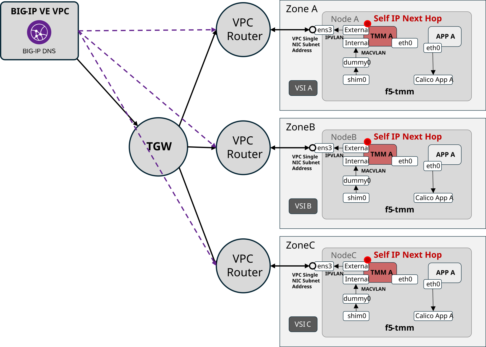
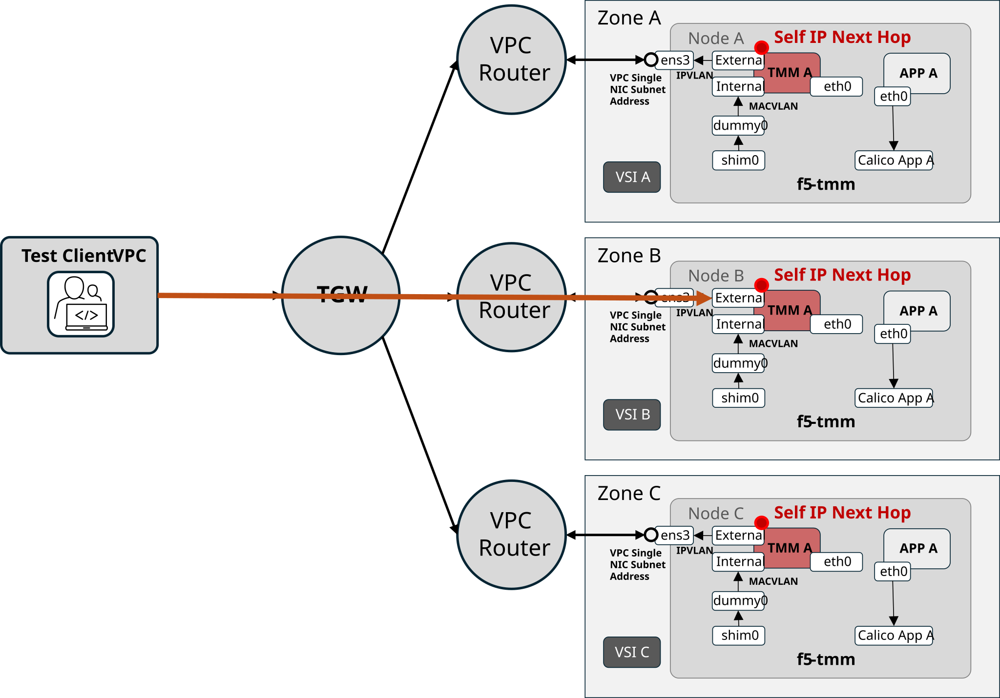
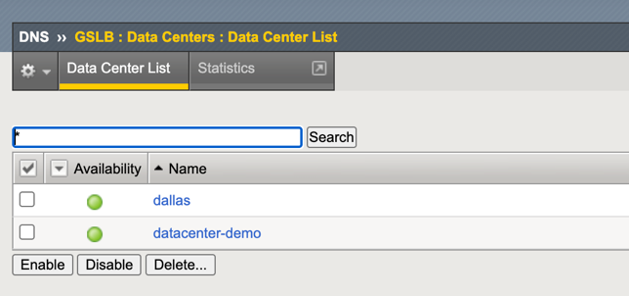
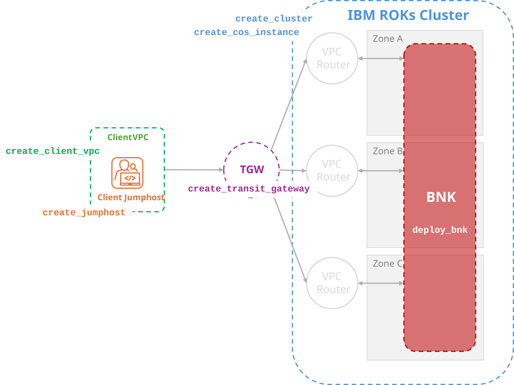

# BIG-IP Next for Kubernetes on IBM ROKs Single NIC Deployment build 2.3.0-ehf-2-3.2598.3-0.0.17

## About This Workspace

This Schematics-ready Terraform workspace corresponds to the F5 engineering March 30th, 2026 demonstration of BIG-IP Next for Kubernetes installed in IBM Cloud ROKs clusters.

### Testable Deployment Features

#### What's New in 2.3.0-EHF-2-3.2598.3-0.0.17

- Static routing control of IBM Cloud VPC routers
- GSLB disaggregation ingress across IBM Cloud availability zones for BIG-IP Virtual Edition DNS Services
- External client service delivery through static VPC routes with attached IBM cloud Transit Gateway
- Inter-VPC client service delivery through static VPC routes

The engineering demonstration code provides the ability to test the following BIG-IP Next for Kubernetes on IBM ROKs cluster features.

#### VPC Static Route Orchestration via F5 CWC

F5 CWC controls IBM Cloud VPC static routes, using f5-tmm pod Self-IP addresses as next-hop addresses for ingress Gateway listeners and as egress SNAT addresses.


#### BIG-IP VE DNS Services / GSLB Integration

BIG-IP Virtual Edition DNS Services provides GSLB access to BIG-IP Next for Kubernetes ingress Gateway listener IP addresses.



#### Transit Gateway Client Access

Ingress and egress flows from an external VPC connected via IBM Cloud Transit Gateway (TGW), using a test client jump host or other TGW-connected clients.



#### In-VPC Ingress from VSIs

Direct ingress from other Virtual Server Instances (VSIs) in the same VPC as the IBM ROKs cluster.


## Prerequisites for BIG-IP Virtual Edition DNS Service testing

A VPC-deployed BIG-IP Virtual Edition with DNS Services enabled should be deployed in an external VPC and connected through an IBM Cloud TGW to the IBM ROKs cluster VPC.

A DNS Services GSLB Data Center must be deployed so that the BIG-IP Next for Kubernetes CWC controller can add Wide IPs and automate Wide IP pool membership with Gateway listener IP addresses.



The GSLB Data Center name will be required for the Terraform `cneinstance_gslb_datacenter_name` variable.

Additionally, the iControl REST credentials to access the BIG-IP DNS Services appliance will be required. They are defined in the following deployment variables:

| Variable | Description | Example |
| -------- | ----------- | ------- |
| `bigip_username` | BIG-IP username for CIS controller login | (default: admin)|
| `bigip_password` | BIG-IP password for CIS controller login | (sensitive) password |
| `bigip_url` | BIG-IP URL for CIS controller login | https://10.100.100.22 |

The CIS controller, deployed within the IBM ROKs cluster, must be able to resolve the URL host and reach the iControl REST endpoint in the BIG-IP DNS Services appliance.

## Deploying with IBM Schematics

The following IBM provider and IAM variables must be defined.

| Variable | Description | Required | Example |
| -------- | ----------- | -------- | ------- |
| `ibmcloud_api_key` | API Key used to authorize all deployment resources. | REQUIRED |`0q7N3CzUn6oKxEsr7fLc1mxkukBeAEcsjNRQOg1kdDSY` (note not a real APIKey) |
| `ibmcloud_cluster_region` | IBM Cloud region for cluster resources. | REQUIRED with default defined | `jp-tok ` (default)|
| `ibmcloud_resource_group` | IBM Cloud resource group name. | REQUIRED with default defined | `default` (default) |


This deployment is modular and presents the following feature flag variables that control which components should be orchestrated in this deployment.



The deployment can orchestrate any or all of the following components:

| Variable | Description | Required | Example |
| -------- | ----------- | -------- | ------- |
| `create_cluster` | Create OpenShift cluster. | REQUIRED with default defined | true (default) |
| `create_cos_instance` | Create Cloud Object Storage instance for IBM ROKs internal registry. This only applies if `create_cluster` is `true`. | REQUIRED with default defined | true (default) |
| `create_transit_gateway` | Create a Transit Gateway and connect it to the IBM ROKs cluster VPC | REQUIRED with default defined | true (default) |
| `create_client_vpc` | Create client VPC. | REQUIRED with default defined | true (default) |
| `create_jumphost` | Create jumphost in client VPC. | REQUIRED with default defined | true (default) |
| `deploy_bnk` | Deploy the F5 BIG-IP Next for Kubernetes in created or specified IBM ROKs cluster | REQUIRED with default defined | true (default) |

### Deployment Variables when Deploying a new IBM ROKs Cluster

( Feature Flags: `create_cluster`,`create_cos_instance`,`create_transit_gateway`)

| Variable | Description | Required | Example |
| -------- | ----------- | -------- | ------- |
| `cluster_vpc_name` | Name of the cluster VPC | REQUIRED when `create_cluster` is true | tf-cluster-vpc (default) |
| `transit_gateway_name` | Name of the transit gateway | REQUIRED when `create_transit_gateway` is true | tf-tgw (default) |
| `cos_instance_name` | Name of the COS instance for IBM ROKs registry | Required when `create_cos_instance` and `create_cluster` are true | tf-cos-instance (default) |
| `openshift_cluster_name` | Name of the OpenShift cluster to create | REQUIRED when `create_cluster` is true | tf-openshift-cluster (default) |
| `workers_per_zone` | Number of worker nodes per zone | REQUIRED when `create_cluster` is true | 1 (default) |
| `min_worker_vcpu_count` | Minimum vCPU count for worker nodes | REQUIRED when `create_cluster` is true | 16 (default) |
| `min_worker_memory_gb` | Minimum memory in GB for worker nodes | REQUIRED when `create_cluster` is true | 64 (default) |
| `cluster_id_existing` | ID or name of existing OpenShift cluster | REQUIRED when `create_cluster` is false | tf-openshift-cluster |

### Deployment Variables when Deploying with an existing IBM ROKs Cluster

| Variable | Description | Required | Example |
| -------- | ----------- | -------- | ------- |
| `cluster_id_existing` | ID or name of existing OpenShift cluster | REQUIRED when `create_cluster` is false | tf-openshift-cluster |


### Deployment Variables when Deploying Client VPC and Client Jumphost

( Feature Flags: `create_client_vpc`, `create_jumphost`)

| Variable | Description | Required | Example |
| -------- | ----------- | -------- | ------- |
| `client_vpc_name` | Name of the client VPC to create or use | REQUIRED when `create_client_vpc` or `create_jumphost` are true | tf-client-vpc |
| `client_vpc_region` | IBM Cloud region for client VPC  | REQUIRED when `create_client_vpc` or `create_jumphost` are true | eu-gb |
| `client_jumphost_name` | Name of the jumphost VSI instance | REQUEST when `create_jumphost` is true | tf-client-jumphost |
| `ssh_key_name` | Name of an existing SSH key name to use for jumphost VSI access | test-jh |


### Deployment Variables when Deploying BIG-IP Next for Kubernetes on a IBM ROKs cluster

( Feature Flag: `deploy_bnk`)

Deploying BIG-IP Next for Kubernetes requires access to the F5 Artifact Repository (FAR software download) and a license JWT token (subscription license).

| Variable | Description | Required | Example |
| -------- | ----------- | -------- | ------- |
| `far_repo_url` | FAR Repository URL for docker and helm registry | REQUIRED if `deploy_bnk` is true | repo.f5.com (default) |
| `license_mode` | License operation mode (connected or disconnected) | REQUIRED if `deploy_bnk` is true | connected (default) |
| `f5_bigip_k8s_manifest_version` | Version of f5-bigip-k8s-manifest chart to install | REQUIRED if `deploy_bnk` is true | 2.3.0-bnpp-ehf-2-3.2598.3-0.0.17 |

#### Deploying with Schematic using IBM COS for F5 Artifact Repository and License JWT token

When deploying with IBM Schematics the FAR container pull credentials and JWT license token should be stored in an IBM Cloud Object Storage (COS) instance, bucket, and resource. These items should be downloaded from myf5.com and places in a COS bucket for use by Schematics when deploying BIG-IP Next for Kubernetes.

| Variable | Description | Required | Example |
| -------- | ----------- | -------- | ------- |
| `use_cos_bucket` | Fetch FAR auth key and JWT from IBM Cloud Object Storage instead of local files | REQUIRED if `deploy_bnk` is true and using Schematics | true (default) |
| `ibmcloud_cos_bucket_region` | IBM Cloud region where the COS bucket is located | REQUIRED if `deploy_bnk` and `use_cos_bucket` are true | us-south (default) |
| `ibmcloud_cos_instance_name` | IBM Cloud COS instance name | REQUIRED if `deploy_bnk` and `use_cos_bucket` are true | bnk-orchestration |
| `ibmcloud_resources_cos_bucket` | IBM Cloud COS bucket for file resources | REQUIRED if `deploy_bnk` and `use_cos_bucket` are true | bnk-schematics-resources |
| `f5_cne_far_auth_file` | FAR auth key filename in COS bucket (.tgz file from myf5.com) | REQUIRED if `deploy_bnk` and `use_cos_bucket` are true | f5-far-auth-key.tgz |
| `f5_cne_subscription_jwt_file` | Subscription JWT filename in COS bucket (.jwt file from myf5.com) | REQUIRED if `deploy_bnk` and `use_cos_bucket` are true | trial.jwt |

As an example using the variable defaults:

1) create a IBM COS instance named `bnk-orchestration`
2) with a bucket named `bnk-schematics-resources` and then
3) upload the FAR pull secret archive file `f5-far-auth-key.tgz` and
4) upload the license JWT token file `trial.jwt`.

```
bnk-orchestrator # IBM COS Instance
├── bnk-schematics-resources  # IBM COS Bucket
│   ├── f5-far-auth-key.tgz   # IBM COS Resource (key)
│   └── trial.jwt             # IBM COS Resource (key)
```


#### Using a local file for F5 Artifact Repository and License JWT token

If terraform is being used on a local machine, the FAR container pull credentials and JWT license token can be read from the local file system. The `use_cos_bucket` should be set to `false` to enable local file access to these resources.

| Variable | Description | Required | Example |
| -------- | ----------- | -------- | ------- |
| `far_service_account_key_path` | Terraform file system path to FAR service account key JSON file | REQUIRED if `deploy_bnk` is true and `use_cos_bucket` is false | /home/user/dev_pull_64.json |
| `jwt_token` | JWT token for F5 license authentication | REQUIRED if `deploy_bnk` is true and `use_cos_bucket` is false | /home/user/trial.jwt |


#### Community Cert-Manager Certificate Mangement
| Variable | Description | Required | Example |
| -------- | ----------- | -------- | ------- |
| `cert_manager_namespace` | Kubernetes namespace for cert-manager | | cert-manager |
| `cert_manager_version` | Helm chart version | | v1.17.3 |


#### F5 Lifecycle Operator (FLO) Installer

| Variable | Description | Required | Example |
| -------- | ----------- | -------- | ------- |
| `flo_namespace` | Namespace for F5 Lifecycle Operator | REQUIRED if `deploy_bnk` is true | f5-bnk (default) |


#### F5 Control Plane Shared Utilities

| Variable | Description | Required | Example |
| -------- | ----------- | -------- | ------- |
| `utils_namespace` | Namespace for F5 utility components | REQUIRED if `deploy_bnk` is true | f5-utils (default) |


#### F5 CIS Controller

| Variable | Description | Required | Example |
| -------- | ----------- | -------- | ------- |
| `bigip_username` | BIG-IP username for CIS controller login | REQUIRED if `deploy_bnk` is true | admin (default) |
| `bigip_password` | BIG-IP password for CIS controller login | REQUIRED if `deploy_bnk` is true | admin |
| `bigip_url` | BIG-IP URL for CIS controller login | REQUIRED if `deploy_bnk` is true | https://10.100.100.1 |


#### Deploy CNE Instance as a Gateway Provider

| Variable | Description | Required | Example |
| -------- | ----------- | -------- | ------- |
| `cneinstance_enabled` | Enable CNEInstance deployment | | true (default) |
| `cluster_vpc_name` | Name of the cluster VPC | REQUIRED when `cneinstance_enabled` is true | tf-cluster-vpc (default) |
| `cneinstance_logging_subsystem` | Enable logging subsystem | | true (default) |
| `cneinstance_metric_subsystem` | Enable metrics subsystem for CNEInstance | | true (default) |
| `cneinstance_firewall_acl` | Enable firewall ACL for CNEInstance | | true (default) |
| `cneinstance_gslb_datacenter_name` | GSLB datacenter name for CNEInstance | | |
| `cneinstance_deployment_size` | Deployment size for CNEInstance | | Small |
| `cneinstance_ibm_trusted_profile_id` | IBM Trusted Profile ID for CNEInstance authentication to orchestrate IBM ROKs and VPC routing table entries | | |


## OCP Security Context Constraints Bindings Detail

BIG-IP Next for Kubernetes required bindings grant `system:openshift:scc:privileged` for the following resources:

| Module | Namespace | Service Accounts |
|--------|-----------|------------------|
| FLO | `f5-bnk` | `flo-f5-lifecycle-operator`, `f5-bigip-ctlr-serviceaccount`, `default` (CIS) |
| CNEInstance | `f5-bnk` | `tmm-sa`, `f5-dssm`, `f5-downloader`, `f5-afm`, `f5-cne-controller-*`, `f5-cne-env-discovery-serviceaccount` |
| CNEInstance | `f5-utils` | `crd-installer`, `cwc`, `f5-coremond`, `f5-rabbitmq`, `f5-observer-operator`, `f5-ipam-ctlr`, `otel-sa`, `f5-crdconversion`, `default` |


## Project Directory Structure

```
terraform-cloud-ibm/
├── main.tf                    # Root module configuration
├── variables.tf               # Root module variables
├── outputs.tf                 # Root module outputs
├── providers.tf               # Provider configuration
├── terraform.tfvars           # Variable values
├── modules/
│   ├── cluster/              # IBM Cloud OpenShift cluster module
│   │   ├── main.tf           # Cluster infrastructure resources
│   │   ├── variables.tf      # Cluster module variables
│   │   ├── outputs.tf        # Cluster module outputs
│   │   └── providers.tf      # Cluster provider configuration
│   ├── cert-manager/         # Cert-manager module
│   │   ├── main.tf           # Cert-manager resources
│   │   ├── variables.tf      # Cert-manager variables
│   │   └── outputs.tf        # Cert-manager outputs
│   ├── flo/                  # FLO (F5 Lifecycle Operator) module
│   │   ├── main.tf           # FLO deployment resources (includes CIS helm chart)
│   │   ├── variables.tf      # FLO module variables
│   │   ├── outputs.tf        # FLO module outputs
│   │   └── versions.tf       # FLO provider requirements
│   ├── cneinstance/          # CNEInstance deployment module
│   │   ├── main.tf           # CNEInstance resources
│   │   ├── variables.tf      # CNEInstance variables
│   │   ├── outputs.tf        # CNEInstance outputs
│   │   └── terraform.tf      # CNEInstance provider requirements
│   └── license/              # License CR module
│       ├── main.tf           # License CR resource
│       ├── variables.tf      # License module variables
│       ├── outputs.tf        # License module outputs
│       └── terraform.tf      # License provider requirements
```

## Module Dependency Chain

```
┌──────────────────────────────────┐
│  1. CLUSTER                      │
│  (IBM Cloud Infrastructure)      │
│                                  │
│  - VPC & Subnets                 │
│  - OpenShift Cluster             │
│  - Transit Gateway               │
│  - COS Instance                  │
└─────────────┬────────────────────┘
              │ (provides kubeconfig)
              ▼
┌──────────────────────────────────┐
│  2. CERT-MANAGER                 │
│  (Certificate Management CRDs)   │
│                                  │
│  - Namespace                     │
│  - Helm Release                  │
│  - CRD Registration              │
└─────────────┬────────────────────┘
              │ (cert-manager.io CRDs: ClusterIssuer, Certificate)
              ▼
┌──────────────────────────────────┐
│  3. FLO                          │
│  (F5 Lifecycle Operator)         │
│                                  │
│  - Cert-Manager ClusterIssuer    │
│  - Certificates                  │
│  - NAD (Network Attachments)     │
│  - Node Labels                   │
│  - F5 Lifecycle Operator Helm    │
│  - F5 BNK CIS Helm               │
│  - BIG-IP Login Secret           │
│  - privileged SCC (3 bindings)   │
└─────────────┬────────────────────┘
              │ (FLO deployed, CRDs ready)
              ▼
┌──────────────────────────────────┐
│  4. CNEINSTANCE                  │
│  (CNEInstance Deployment)        │
│                                  │
│  - CNEInstance Custom Resource   │
│  - privileged SCC (16 bindings)  │
│  - Pod Health Validation         │
└─────────────┬────────────────────┘
              │ (License CRD registered)
              ▼
┌──────────────────────────────────┐
│  5. LICENSE                      │
│  (F5 BNK License CR)             │
│                                  │
│  - License Custom Resource       │
│    (k8s.f5net.com/v1)            │
│  - JWT + Operation Mode          │
└──────────────────────────────────┘
```
## Local Host Installation & Deployment

### Why Five Separate Modules?

**Dependency Resolution**: Terraform validates CRDs during planning, not apply:
1. **Cluster** must deploy first (base infrastructure) - **or use an existing cluster**
2. **Cert-Manager** must deploy second to register CRDs before FLO resources are validated
3. **FLO** must deploy third to register its CRD before CNEInstance is validated. Also deploys CIS and BIG-IP login secret
4. **CNEInstance** deploys fourth after FLO is fully operational
5. **License** deploys fifth after CNEInstance registers the License CRD

This sequential approach avoids validation errors and ensures proper dependency ordering.

### Using an Existing Cluster (Skip Cluster Module)

If you already have an OpenShift cluster running in IBM Cloud, you can skip the cluster creation and deploy directly to it:

**In `terraform.tfvars`:**
```hcl
# Skip cluster creation and use existing cluster
create_cluster      = false
cluster_id_existing = "YOUR_CLUSTER_ID_OR_NAME"  # Get from `ibmcloud ks clusters`
ibmcloud_cluster_region      = "jp-tok"          # Region where cluster exists

# Enable BNK/FLO deployment
deploy_bnk = true
```

**Get your existing cluster ID/name:**
```bash
ibmcloud ks clusters --provider vpc-gen2
```

**Then deploy directly to existing cluster:**
```bash
# Deploy all modules to existing cluster (no cluster creation)
terraform apply -auto-approve
```

**Or step-by-step:**
```bash
terraform apply -target=module.cert_manager -auto-approve
terraform apply -target=module.flo -auto-approve
terraform apply -target=module.cneinstance -auto-approve
terraform apply -target=module.license -auto-approve
```

### Prerequisites
1. Update `terraform.tfvars` with your IBM Cloud API key and cluster configuration
2. Run `terraform init` to initialize all modules
3. Ensure `deploy_bnk = true` in terraform.tfvars to enable BNK/FLO deployment

### Recommended Deployment Order

#### Step 1: Deploy Cluster (60–90 min)
```bash
terraform plan -target=module.cluster
terraform apply -target=module.cluster -auto-approve
```

#### Step 2: Deploy Cert-Manager (2–3 min)
```bash
terraform plan -target=module.cert_manager
terraform apply -target=module.cert_manager -auto-approve
```

#### Step 3: Deploy FLO — F5 Lifecycle Operator (5–10 min)
```bash
terraform plan -target=module.flo
terraform apply -target=module.flo -auto-approve
```

#### Step 4: Deploy CNEInstance (5–10 min)
```bash
terraform plan -target=module.cneinstance
terraform apply -target=module.cneinstance -auto-approve
```

#### Step 5: Deploy License (1–2 min)
```bash
terraform plan -target=module.license
terraform apply -target=module.license -auto-approve
```


### Cleanup (Reverse Order)

```bash
# Destroy in reverse dependency order
terraform destroy -target=module.license -auto-approve
terraform destroy -target=module.cneinstance -auto-approve
terraform destroy -target=module.flo -auto-approve
terraform destroy -target=module.cert_manager -auto-approve
terraform destroy -target=module.cluster -auto-approve
```

## Configuration

### Module-Level Variables

#### Cluster Module
- `ibmcloud_api_key`: IBM Cloud API key for authentication
- `cluster_region`: IBM Cloud region for cluster resources (default: `ca-tor`)
- `resource_group`: Resource group name (default: account default)
- `openshift_cluster_name`: Name of the OpenShift cluster (default: `tf-cluster`)
- `workers_per_zone`: Number of worker nodes per zone (default: `1`)
- `min_worker_vcpu_count` / `min_worker_memory_gb`: Minimum worker flavor requirements
- `create_cluster`, `create_client_vpc`, `create_jumphost`, `create_transit_gateway`, `create_cos_instance`: Feature flags
- `skip_cluster_health_check`: Skip post-create health validation (default: `true`)

#### Cert-Manager Module
- `enabled`: Enable/disable cert-manager deployment (controlled by deploy_bnk)
- `cert_manager_namespace`: Kubernetes namespace for cert-manager (default: `cert-manager`)
- `chart_version`: Helm chart version (default: `v1.16.1`)
- `repository`: Helm repository URL
- `wait_for_deployment`: Wait for deployment to be ready (default: true)
- `post_deployment_delay`: Time to wait after deployment for CRD registration (default: 30s)

#### FLO (F5 Lifecycle Operator) Module
- `enabled`: Enable/disable module (controlled by deploy_bnk)
- `cert_manager_crd_ready`: **CRITICAL** - Dependency trigger from cert-manager module (ensures CRDs exist before plan validates manifests)
- `bigip_username`: BIG-IP username for CIS controller login (default: admin)
- `bigip_password`: BIG-IP password for CIS controller login (sensitive)
- `bigip_url`: BIG-IP URL for CIS controller login (https:// prefix is stripped automatically)
- All FLO configuration variables (NAD, CNEInstance settings, etc.)

**IBM IAM Trusted Profile** (created by FLO module, passed to CNEInstance):
- `openshift_cluster_name`: Name of the OpenShift cluster — used to make the trusted profile name unique per cluster (sourced from cluster module output)
- `openshift_cluster_crn`: CRN of the OpenShift cluster — used to link the trusted profile to the ROKS service account `f5-cne-controller-<flo_namespace>-f5-cne-controller-serviceaccount` in `flo_namespace` (sourced from cluster module output)
- `cluster_vpc_id`: ID of the cluster VPC — grants the trusted profile Viewer and Editor IAM roles on this VPC (sourced from cluster module output)

> The trusted profile is created only when `enabled = true` and `openshift_cluster_crn` is non-empty. The resulting profile ID is output as `trusted_profile_id` and automatically passed to the CNEInstance module as `cneinstance_ibm_trusted_profile_id`.

**COS Bucket Integration** (fetch FAR auth key and JWT from IBM Cloud Object Storage):
- `use_cos_bucket`: Enable fetching FAR auth key and JWT from COS instead of local files (default: `true`)
- `ibmcloud_cos_bucket_region`: IBM Cloud region where the COS bucket is located (default: `us-south`)
- `ibmcloud_cos_instance_name`: IBM Cloud COS instance name (default: `bnk-orchestration`)
- `ibmcloud_resources_cos_bucket`: COS bucket name containing FAR auth key and JWT files (default: `bnk-schematics-resources`)
- `f5_cne_far_auth_file`: FAR auth key filename in COS bucket, must be `.tgz` (default: `f5-far-auth-key.tgz`)
- `f5_cne_subscription_jwt_file`: Subscription JWT filename in COS bucket (default: `trial.jwt`)

> When `use_cos_bucket = true`, the FLO module uses the IBM Cloud API key to exchange for an IAM token, then downloads the FAR auth key archive and JWT from the COS bucket via the S3 REST API. The `.tgz` archive is automatically extracted and the JSON key file inside is auto-detected. The JWT fetched from COS is also passed to the License module (instead of the `jwt_token` variable).

#### License Module
- `enabled`: Enable/disable license deployment (controlled by deploy_bnk && cneinstance_enabled)
- `utils_namespace`: Namespace where License CR is deployed (default: f5-utils)
- `jwt_token`: JWT token for F5 license authentication (sensitive)
- `license_mode`: License operation mode - `connected` or `disconnected` (default: connected)
- `cneinstance_dependency`: Explicit dependency on CNEInstance module

### Required Variables (terraform.tfvars)

**Shared configuration (both options):**
```hcl
ibmcloud_api_key = "YOUR_API_KEY"
cluster_region   = "jp-tok"

# FAR Registry
far_repo_url = "repo.f5.com"
#far_service_account_key_path = "/home/dev/dev_pull_64.json"

# COS Bucket — fetch FAR auth key and JWT from IBM COS
use_cos_bucket                = true
ibmcloud_cos_bucket_region    = "us-south"
ibmcloud_cos_instance_name    = "bnk-orchestration"
ibmcloud_resources_cos_bucket = "bnk-schematics-resources"
f5_cne_far_auth_file          = "f5-far-auth-key.tgz"
f5_cne_subscription_jwt_file  = "trial.jwt"

# FLO
flo_namespace   = "f5-bnk"
utils_namespace = "f5-utils"
license_mode    = "connected"

# BIG-IP CIS (optional)
bigip_username = "admin"
bigip_password = "YOUR_BIGIP_PASSWORD"
bigip_url      = "https://your-bigip-url"

# Manifest version
f5_bigip_k8s_manifest_version = "YOUR_K8S_MANIFEST_VERSION"

# CNEInstance
cneinstance_deployment_size        = "Small"
cneinstance_vpc_name               = ""
cneinstance_cloud_region           = ""
cneinstance_ibm_trusted_profile_id = ""
cneinstance_gslb_datacenter_name   = ""

# cert-manager
cert_manager_namespace = "cert-manager"
cert_manager_version   = "v1.16.1"
```

**Option A — create new cluster (60–90 min):**
```hcl
openshift_cluster_name = "tf-cluster"
workers_per_zone       = 1

create_cluster         = true
create_client_vpc      = true
create_jumphost        = true
create_transit_gateway = true
create_cos_instance    = true  # required for OpenShift registry

deploy_bnk = false  # set true to also deploy BNK
```

**Option B — use existing cluster (5–10 min):**
```hcl
create_cluster      = false
cluster_id_existing = "YOUR_CLUSTER_ID"  # ibmcloud ks clusters --provider vpc-gen2

create_client_vpc      = false
create_jumphost        = false
create_transit_gateway = false
create_cos_instance    = false

deploy_bnk = true
```

## Outputs

View all outputs:
```bash
terraform output                                   # All outputs
terraform output cluster_id                        # Specific output
```

## Debugging & Troubleshooting

**View module-specific changes:**
```bash
# Plan specific modules
terraform plan -target=module.cluster
terraform plan -target=module.cert_manager
terraform plan -target=module.flo
terraform plan -target=module.cneinstance
terraform plan -target=module.license
```

**List resources by module:**
```bash
terraform state list module.cluster
terraform state list module.cert_manager
terraform state list module.flo
terraform state list module.cneinstance
terraform state list module.license
```

**Validate configuration:**
```bash
terraform validate
terraform state list
```

**Common issues:**

| Issue | Solution |
|-------|----------|
| "no matches for kind ClusterIssuer" during plan | Wait for cert-manager module. Follow step-by-step deployment order. |
| "no matches for kind CNEInstance" during plan | Wait for FLO module to deploy. CNEInstance CRD registered by FLO. |
| "no matches for kind License" during plan | Wait for CNEInstance module to deploy. License CRD registered by crd-installer. |
| "field manager conflict" on CNEInstance | The `force_conflicts = true` field_manager is already set. If it persists, check for manual edits to the CR. |
| "clusterrolebinding already exists" for SCC | The SCC binding was created by another module (e.g., CIS SCC in flo). Remove from cneinstance scc_policy_assignments if duplicate. |
| License CR stuck in "Registering" state | Verify the JWT token is valid and the cluster has internet access for `connected` mode. |
